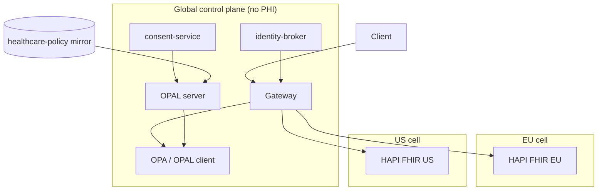

<p align="center">
  
</p>

<h1 align="center">Cloud Healthcare Exchange</h1>

<p align="center">
  <strong>Federated health information exchange reference implementation</strong><br/>
  EU + US jurisdiction cells · OPA policy-as-code · OPAL live consent · FHIR R4
</p>

<p align="center">
  <a href="https://github.com/SafetyMP/Healthcare-Data-Exchange/actions/workflows/portfolio-verify.yml"></a>
  <a href="https://github.com/SafetyMP/Healthcare-Data-Exchange/actions/workflows/codeql.yml"></a>
  <a href="https://scorecard.dev/viewer/?uri=github.com/SafetyMP/Healthcare-Data-Exchange"></a>
  <a href="LICENSE"></a>
  <a href="https://github.com/SafetyMP/Healthcare-Data-Exchange/releases"></a>
</p>

<p align="center">
  <a href="#quick-start">Quick start</a> ·
  <a href="#what-the-demo-proves">Demo</a> ·
  <a href="#architecture">Architecture</a> ·
  <a href="docs/README.md">Docs</a> ·
  <a href="CONTRIBUTING.md">Contributing</a> ·
  <a href="SECURITY.md">Security</a>
</p>

---

> **Scope:** Design authority + walking skeleton. Demonstrates patterns toward FedRAMP High, GDPR/EHDS, and EU AI Act alignment — **not** certification, an ATO, or production deployment guidance.

## Why this exists

Centralizing health data in one global database fails sovereignty, erasure, and cross-border transfer rules. Cloud Healthcare Exchange models:

| Principle | What it means in this repo |
|-----------|----------------------------|
| **Sovereignty by cell** | PHI, keys, and primary audit stay in-region (EU / US HAPI cells) |
| **Global plane is config-only** | Routing, tenants, policy bundles, consent metadata — no PHI |
| **Policy-as-code** | OPA Rego at the gateway PEP; tests in CI |
| **Federated identity** | ITI-78-style broker stub — no fictional EU-wide MPI |
| **Live consent** | OPAL propagates revocation to the PDP without restart |

See [architecture overview](docs/architecture/overview.md) and [product mandate](docs/product-mandate.md).

## Quick start

**Prerequisites:** Docker, Go 1.22+, Python 3.12+

```bash
git clone https://github.com/SafetyMP/Healthcare-Data-Exchange.git
cd Healthcare-Data-Exchange

# Hermetic definition of done (no Docker required)
./scripts/verify.sh

# Full stack: EU + US HAPI, OPAL, gateway, services (~2 min JVM boot)
./scripts/run-dev.sh

# End-to-end proof (compose must be running)
./scripts/demo.sh
```

First `run-dev.sh` generates local OPAL dev secrets under `deploy/opal/` (gitignored).

## What the demo proves

| Scenario | Evidence |
|:---------|:---------|
| Intra-EU treatment read | Residency + minimum-necessary fields |
| Research without consent | `403 consent_required` |
| Cross-bloc deny / exception | Deny-by-default + derivative exception path |
| US TEFCA + SSRAA stub | 401 without token, 200 with association |
| Identity broker (ITI-78) | Direct resolve + gateway patient read by identifier |
| Live consent revoke/grant | 403↔200 via OPAL with no restart |
| AI triage gate | Human oversight required (Art. 50 transparency stub) |
| Tenant crypto-shred | 410 Gone after key destruction |

## Architecture

<p align="center">
  
</p>



| Service | Port | Role |
|---------|------|------|
| Gateway | 8081 | Jurisdiction router, OPA PEP, admin APIs |
| OPA (opal-client) | 8181 | Policy decision point |
| OPAL server | 7002 | Policy + consent sync |
| consent-service | 8084 | Dynamic consent + OPAL publish |
| identity-broker | 8085 | Preferred-identifier resolve |
| ai-governance | 8082 | AI triage + oversight stub |
| HAPI EU / US | 8080 / 8083 | Synthetic FHIR R4 patients |

## Repository layout

| Path | Purpose |
|------|---------|
| `services/gateway/` | Go jurisdiction router + PEP |
| `services/consent-service/` | OPAL consent data source |
| `services/identity-broker/` | ITI-78 identifier broker |
| `services/ai-governance/` | AI governance stub |
| `policy/` | Canonical OPA Rego (+ tests) |
| `config/` | Routing, SSRAA, identity registry, OPAL profile |
| `deploy/docker-compose.yml` | EU + US cells + OPAL stack |
| `docs/` | Mandate, architecture, ADRs, roadmap |
| `scripts/verify.sh` | Hermetic definition of done |
| `scripts/demo.sh` | Compose E2E demonstration |

## Multi-repo portfolio

Policy consumed by OPAL is mirrored to [healthcare-policy](https://github.com/SafetyMP/healthcare-policy). Edit `policy/*.rego` here, run `./scripts/sync-policy-repo.sh`, then `./scripts/demo.sh`. See [specs/portfolio.yaml](specs/portfolio.yaml) and [ADR 0007](docs/adr/0007-opal-policy-mirror.md).

## Documentation

| Resource | Link |
|----------|------|
| Docs index | [docs/README.md](docs/README.md) |
| Roadmap | [docs/roadmap.md](docs/roadmap.md) |
| ADRs | [docs/adr/](docs/adr/) (0001–0011) |
| Compliance mapping | [docs/architecture/compliance-mapping.md](docs/architecture/compliance-mapping.md) |
| Changelog | [CHANGELOG.md](CHANGELOG.md) |
| Governance | [GOVERNANCE.md](GOVERNANCE.md) |
| Cite this repo | [CITATION.cff](CITATION.cff) |

## Contributing

Contributions welcome. Read [CONTRIBUTING.md](CONTRIBUTING.md), run `./scripts/verify.sh` before opening a PR, and use `./scripts/demo.sh` when touching compose or runtime paths. Need help? See [SUPPORT.md](SUPPORT.md).

## Security

Synthetic FHIR samples only — no real PHI. See [SECURITY.md](SECURITY.md) for vulnerability reporting via [private vulnerability reporting](https://github.com/SafetyMP/Healthcare-Data-Exchange/security/advisories/new).

## License

Apache License 2.0 — see [LICENSE](LICENSE) and [NOTICE](NOTICE).
