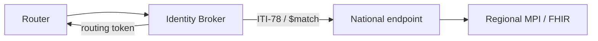

# ADR 0006: Patient Identity and Federated Matching

**Status:** Accepted  
**Date:** 2026-07-08  
**Product:** Cloud Healthcare Exchange

## Context

Early designs assumed a jurisdiction router could "find the patient in the EU cell." There is **no EU-wide master patient index**. MyHealth@EU resolves identity by routing between **National Contact Points** to each member state's MPI.

Sending demographics abroad for probabilistic matching raises GDPR minimization and transfer questions.

## Decision

Implement an **identity broker** in the global control plane that:

1. Accepts lookup requests with **preferred identifier** (national ID, EHIC-linked identifier, MPI token) when available.
2. Uses **IHE PDQm ITI-78** (query by identifier) against the **home** regional endpoint.
3. When no identifier exists, uses **ITI-119 `$match`** with `onlyCertainMatches=true` **only within the home jurisdiction** — not global demographic broadcast.
4. Returns a **routing token** (jurisdiction + opaque subject reference) to the router — not a global patient record.

### Prohibited patterns

- Global demographic search across cells
- Storing PHI in broker logs
- Assuming single EU MPI

## Consequences

**Positive**

- Aligns with EHDS / eHDSI patient lookup strategy.
- Minimizes cross-border matching traffic.

**Negative**

- Higher latency (federated hops).
- Requires bilateral NCP trust configuration (Phase).
- `$match` without identifier remains sensitive — policy must gate tightly.

## PoC simplification

Reference slice uses **pre-seeded identifiers** in config mapping subject → home cell, with broker interface stubbed to demonstrate routing contract. Full NCP federation is Phase 2.

## References

- REF-EHDS-02, REF-EHDS-03
- [data-flows.md](../architecture/data-flows.md)
