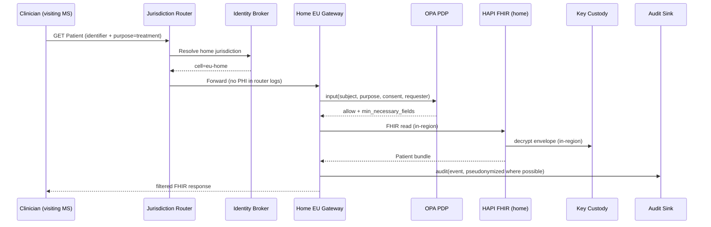
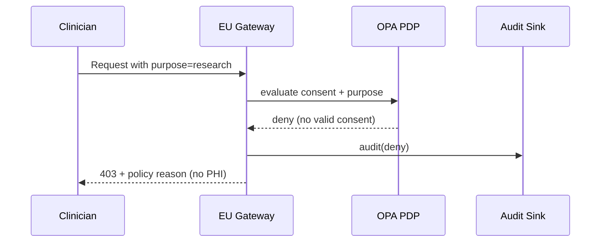
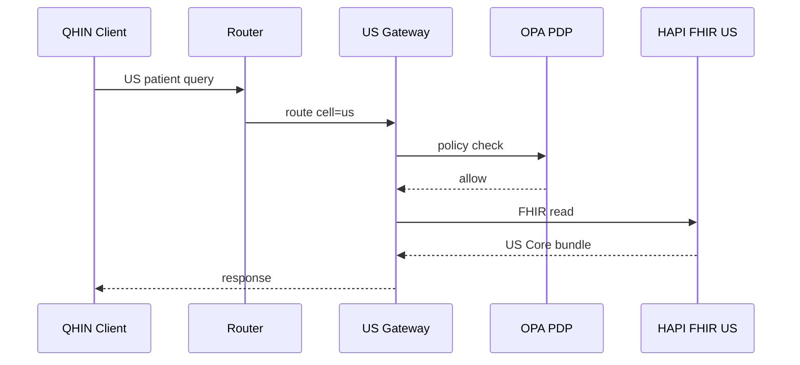
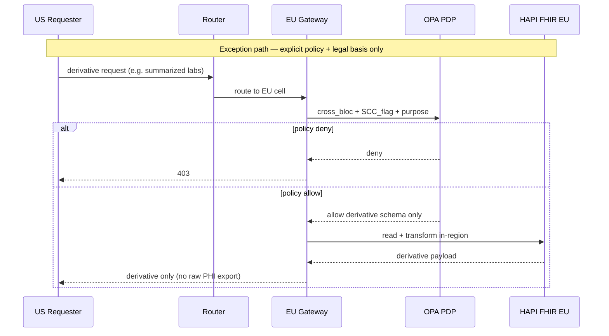
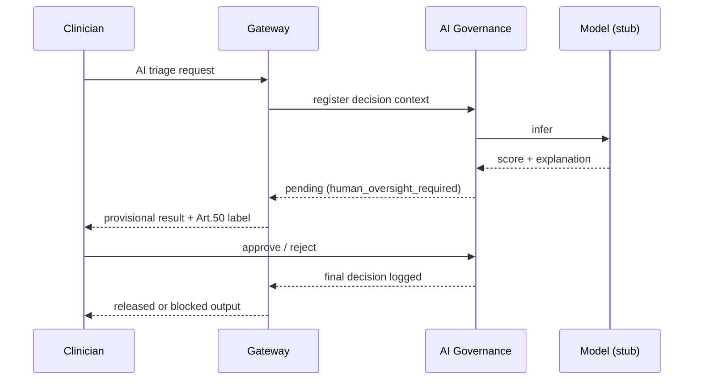

# Data Flows — Cloud Healthcare Exchange

**Product:** Cloud Healthcare Exchange  
**Primary demo:** Intra-EU (MyHealth@EU-style)  
**Secondary:** US TEFCA path  
**Exception:** Cross-bloc derivative (labeled, policy-gated)

---

## Flow 1 — Intra-EU primary (visiting clinician, home data)

EU clinician treats patient whose records live in **home member state**. Data never leaves home cell; visiting clinician receives minimum-necessary response via brokered route.



**Compliance hooks:** GDPR Art. 5 minimization, Art. 9; EHDS primary use; no Chapter V transfer (data stayed home).

---

## Flow 2 — Consent denied



---

## Flow 3 — US TEFCA (secondary demo)

US clinician accesses US patient via QHIN. All processing in **US cell** (SA-9(5)).



---

## Flow 4 — Cross-bloc exception (not headline)

EU-origin patient; **minimum-necessary derivative** requested by US requester. Raw PHI does **not** leave EU cell.



**Risk:** EU→US Article 9 transfer — DPF not default; SCC+TIA required (Proc).

---

## Flow 5 — Region/tenant erasure (crypto-shred)

```mermaid
sequenceDiagram
  participant Admin as Tenant Admin
  participant G as EU Gateway
  participant K as Key Custody
  participant F as HAPI FHIR EU

  Admin->>G: erasure request (tenant scope)
  G->>K: destroy tenant master key
  K-->>G: key destroyed
  Note over F: ciphertext blobs unreadable;<br/>indexes may retain searchable metadata (ADR 0003)
  G-->>Admin: erasure complete (scope documented)
```

---

## Flow 6 — AI feature with human oversight

Applies only when clinician invokes an **AI-assisted** feature (not standard FHIR read).



---

## Data classification by plane

| Data type | Global plane | EU cell | US cell |
|-----------|--------------|---------|---------|
| FHIR Patient/Observation | Never | Yes | Yes |
| Tenant routing config | Yes | Replica | Replica |
| OPA policy bundles | Metadata only | Full eval in-region | Full eval in-region |
| AI model weights | Registry metadata | Inference in-region | Inference in-region |
| Audit with patient ID | Never raw export | Regional sink | Regional sink |

---

## Related documents

- [overview.md](overview.md)
- [compliance-mapping.md](compliance-mapping.md)
- [../adr/0006-patient-identity-matching.md](../adr/0006-patient-identity-matching.md)
