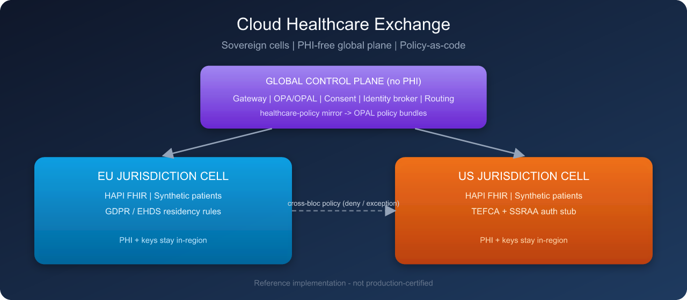
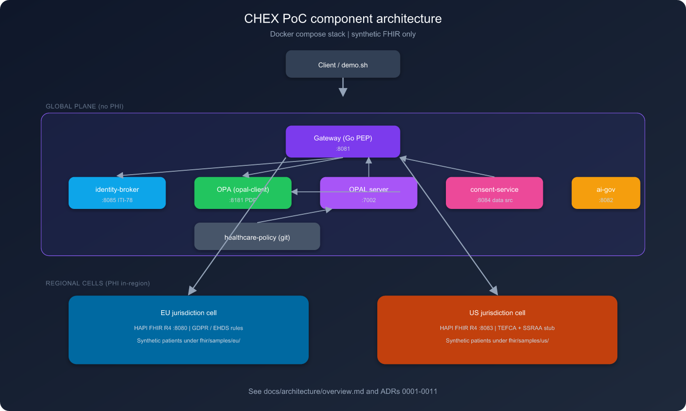
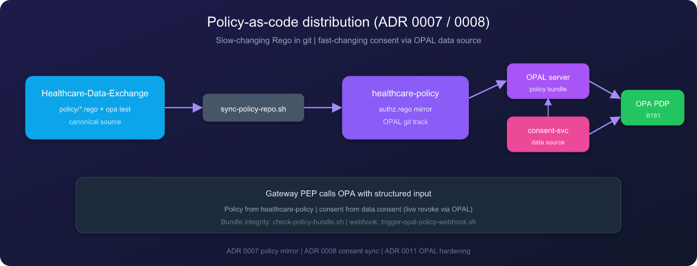
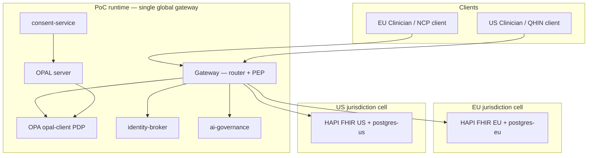
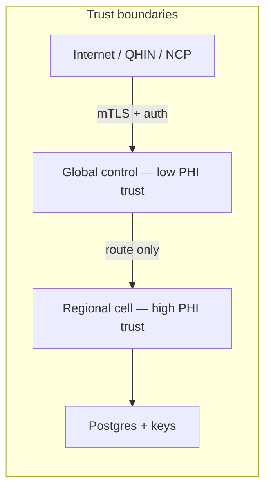

# Architecture Overview — Cloud Healthcare Exchange

**Product:** Cloud Healthcare Exchange  
**Version:** 0.1 (design authority)  
**See also:** [compliance-mapping.md](compliance-mapping.md), [data-flows.md](data-flows.md)

---

## Problem statement

Health data exchange must span organizations and jurisdictions while respecting **conflicting legal regimes**: US federal cloud security (FedRAMP High baseline), EU GDPR and EHDS, and EU AI Act obligations for AI-assisted clinical features. A single global database fails sovereignty, erasure, and transfer rules.

Cloud Healthcare Exchange solves this as a **federation of jurisdiction cells** joined by a **PHI-free control plane**.

---

## Logical architecture

  

  

  

> **PoC note:** Production target architecture uses **per-cell region gateways** (see ADR 0001). The walking skeleton runs one `gateway` service that routes to both FHIR cells via `config/routing.yaml`.

### Planes

| Plane | Contents | PHI |
|-------|----------|-----|
| **Global control** | Routing, tenants, policy bundles, AI model registry metadata, identity broker state (pseudonymous routing tokens) | No |
| **Regional data** | FHIR resources, Postgres, regional keys, regional audit | Yes (in-region) |

---

## Components

### Jurisdiction router (Go)

- Terminates client requests (TLS, authn stub → SSRAA/UDAP in production).
- Selects target cell from tenant config and patient home jurisdiction.
- Delegates authorization to regional PEP; never caches PHI in global memory.

### Policy Enforcement Point (Go, in-region)

- Calls OPA with structured input: subject, purpose, consent flags, resource type, requester jurisdiction.
- Enforces **minimum necessary** response shaping (field filtering).
- Emits audit events to regional sink.

### OPA (Rego PDP)

- Evaluates consolidated `policy/authz.rego` (residency, consent via `data.consent`, purpose).
- PoC: `opal-client` sidecar; HTTP API from gateway.
- **OPAL consent sync implemented** (ADR 0008): `consent-service` publishes revocations; no gateway restart.
- Target: Envoy `ext_authz` sidecar in production mesh.

### FHIR data plane (HAPI + Postgres)

- One database per jurisdiction cell (separate-DB isolation).
- US Core **6.1.0** + USCDI **v3** floor for US cell (PoC subset); EU profiles for EU cell in target state. TEFCA Facilitated FHIR pattern only (not QHIN).
- Search indexes (`HFJ_SPIDX_*`) constrain erasure granularity (see ADR 0003).

### Key custody

- Envelope encryption with region/tenant master keys.
- PoC: software KMS stand-in representing Cloud KMS / Key Vault / CloudHSM.

### AI governance (Python/FastAPI)

- Model registry, inference decision log, human-oversight gate, Art. 50 transparency flag.
- Applies only when gateway invokes an **AI feature** — not for deterministic reads.

### Identity broker

- Federated lookup: route to home NCP / regional MPI via identifier or constrained `$match`.
- No EU-wide MPI (ADR 0006).

---

## Reference slice (walking skeleton)

**PoC on `main` (Phase 4b):** dual EU + US cells, single global gateway, OPAL consent sync, identity broker, SSRAA stub.

| Service | Role |
|---------|------|
| `gateway` | Global router + PEP (proxies to identity-broker, consent-service, FHIR cells) |
| `opal-client` + `opal-server` | PDP + policy/consent distribution |
| `consent-service` | Dynamic consent + OPAL publish |
| `identity-broker` | ITI-78-style identifier resolve |
| `hapi-eu` / `hapi-us` + Postgres | Regional FHIR data planes |
| `ai-governance` | AI triage + oversight stub |

Phase 1–3 delivered the EU-centric skeleton; Phase 4a/4b extended to US cell, OPAL hardening, and dedicated broker service. See [roadmap.md](../roadmap.md).

---

## Deployment targets

| Environment | Orchestration |
|-------------|---------------|
| Local dev | `docker-compose` via `scripts/run-dev.sh` |
| Production target | Kubernetes, GitOps, service mesh (mTLS), Kyverno admission, OPA `ext_authz` |

Out of scope for reference slice: Terraform, GovCloud, multi-region K8s.

---

## Security boundaries

- **Fail closed:** PDP deny → no FHIR read.
- **Default deny cross-border PHI** — derivatives only with explicit policy path.
- **Secrets:** never in repo; `protect-secrets` hook blocks `.env` reads in agent sessions.

---

## Related ADRs

| ADR | Topic |
|-----|-------|
| [0001](../adr/0001-jurisdiction-cells.md) | Jurisdiction cells |
| [0002](../adr/0002-policy-opa-cedar.md) | OPA + Cedar notes |
| [0003](../adr/0003-key-custody-crypto-shred.md) | Keys and erasure |
| [0004](../adr/0004-fhir-us-core-interop.md) | FHIR / US Core |
| [0005](../adr/0005-ai-governance-layer.md) | AI governance |
| [0006](../adr/0006-patient-identity-matching.md) | Patient identity |
| [0007](../adr/0007-opal-policy-mirror.md) | Policy mirror repo |
| [0008](../adr/0008-opal-consent-sync.md) | OPAL consent sync |
| [0009](../adr/0009-ssraa-auth-stub.md) | SSRAA authentication stub |
| [0010](../adr/0010-identity-broker-service.md) | Identity broker service |
| [0011](../adr/0011-opal-production-hardening.md) | OPAL hardening |
