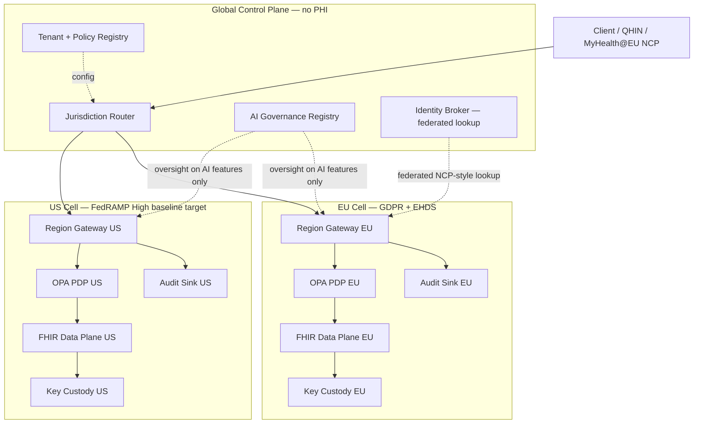
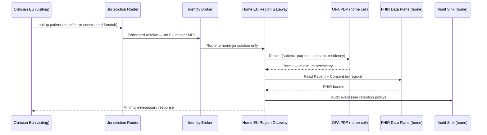
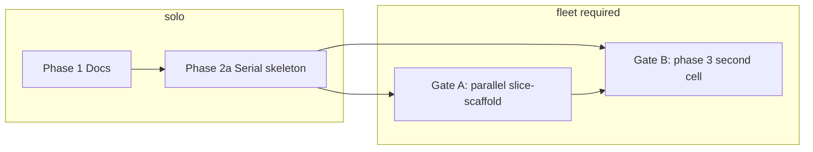

# Healthcare Exchange — Implementation Plan (corrected)

**Status:** Active plan (post hostile self-audit, 2026-07-08)  
**Harness profile:** `solo` — phase 3 complete; fleet mandate HALTED. See [Fleet playbook](#fleet-initialization-playbook) for future parallel work.  
**Deliverable default:** Design-document set + minimal runnable **walking skeleton** (one jurisdiction cell first), wired into `scripts/verify.sh` (hermetic) and `scripts/demo.sh` (compose E2E).

---

## Goal

Turn the harness scaffold into a defined project: a **globally distributed, multi-tenant health information exchange** whose defining constraint is alignment with **FedRAMP High baseline (410 controls)**, **GDPR**, and the **EU AI Act**, with **EHDS** and **TEFCA/FHIR** as the interoperability substrate.

**Precision:** We architect toward these regimes and pursue authorization where applicable (e.g., FedRAMP ATO via sponsoring agency). Tech choices alone do not constitute compliance or an ATO.

---

## Core architecture (target state)

Sovereignty is a **control-plane** property: PHI never sits in the global plane. Each jurisdiction is an isolated **cell** with in-region data, keys, and audit.



### Primary demo flow (corrected)

**Do not** headline with “US clinician queries EU patient” — that is an EU→US transfer of Article 9 health data into a US jurisdiction and is legally the hardest, DPF-fragile direction.

| Demo | Purpose |
|------|---------|
| **Primary** | **Intra-EU** (MyHealth@EU-style): home-jurisdiction resolution via NCP→NCP / federated query; consent at point of care |
| **Secondary** | **US (TEFCA)**: US entity QHIN path, US residency (SA-9(5)) |
| **Exception** | Cross-bloc derivative exchange — explicitly labeled, minimum-necessary, SCC + exporter-held keys; **no default cross-border PHI** |



---

## Compliance mapping (corrected)

### FedRAMP High

| Wrong (dropped) | Correct |
|-----------------|---------|
| “FedRAMP High requires US-person access” | FedRAMP has **no government-wide citizenship requirement**. US-person staffing is agency/ITAR/DoD-specific, not a FedRAMP High requirement. |
| “Be FedRAMP High by architecture” | **SA-9(5)** restricts processing/storage/service location to **US jurisdiction** for High-impact data. Pursue **ATO** on Agency path; ConMon, IR, personnel screening are process obligations, not code-only. |

### GDPR / transfers

| Topic | Design stance |
|-------|---------------|
| Default | **No cross-border PHI**; data stays in jurisdiction cell |
| DPF | **Unreliable** post-*Trump v. Slaughter* (2026-06-29); noyb “Schrems III,” Latombe at CJEU, EDPB assessing. **Do not lean on DPF.** |
| When transfer unavoidable | SCCs + TIA + **exporter-controlled keys in EEA**; pseudonymized/aggregated derivatives only where permitted |

### Crypto-shredding vs HAPI FHIR (reconciled)

| Claim (wrong) | Reality |
|---------------|---------|
| Per-subject crypto-shred on stock HAPI | **Incompatible** with searchable plaintext indexes (`HFJ_SPIDX_*`). Per-subject key destruction breaks search or leaves PHI in indexes. |
| **Correct framing** | **Per-region / per-tenant** shred (drop DB/tablespace key = erase cell). Or app-layer envelope encryption on specific blobs with FHIR search disabled on those elements. |

### Audit vs erasure

| Claim (wrong) | Reality |
|---------------|---------|
| “No direct identifiers in audit logs” | Cross-border health exchange may require **ATNA-style audit** with patient IDs, **~10 year retention** (sectoral mandate). Collides with erasure — **audit retention is a separate legal obligation** where applicable. Pseudonymize where permitted; do not claim zero identifiers. |

### EU AI Act (status corrected)

- **Adopted** (Council 2026-06-29; Parliament 2026-06-16); awaiting OJ publication.
- **Article 50 transparency:** 2026-08-02 (not delayed); watermarking grace → 2026-12-02.
- **Annex III standalone high-risk:** 2027-12-02.
- **Annex I embedded (medical-device AI):** 2028-08-02.
- **Scope discipline:** The exchange platform is **not** “AI.” Only specific components (e.g., AI triage, risk-scoring) are high-risk. Deterministic routing/record linkage is **out of AI Act scope**.

### EHDS / TEFCA

- **EHDS:** MyHealth@EU (primary use), HealthData@EU + secure processing environment (secondary, opt-out).
- **TEFCA:** QHINs must be **US entities**; US cell aligns with TEFCA Facilitated FHIR + SSRAA (required for new FHIR nodes **2027-01-01**).

### Patient identity (no longer hand-waved)

There is **no EU-level master patient index**. MyHealth@EU resolves via **NCP→NCP** to home-country MPI:

- IHE PDQm ITI-78 (by identifier), or
- ITI-119 `$match` with `onlyCertainMatches=true` when no identifier exists.

Demographics sent abroad for matching is itself a minimization/transfer question. **ADR 0006** covers federated-query-to-home with an identity broker.

---

## Tech stack (revised, PoC-honest)

| Layer | Choice | PoC rationale |
|-------|--------|---------------|
| FHIR data plane | HAPI FHIR R4 + US Core 6.1.0, **one Postgres per jurisdiction** | Real interop substrate; `hapiproject/hapi` Docker image (no local Java) |
| Gateway / PEP (hot path) | **Go** — router + OPA client + audit emitter | Matches production target, static binary, small attack surface — **not** sub-ms latency in PoC (that requires Envoy `ext_authz` mesh, out of scope) |
| Policy | **OPA (Rego)** as PDP container | PoC: HTTP from gateway; prod: sidecar `ext_authz` + OPAL for consent revocation |
| Keys | Envelope encryption; **software KMS stand-in** | Represents HSM/cloud KMS in prod; shred at **region/tenant** granularity |
| AI governance | **Python 3.12 + FastAPI** — only for AI plane | Model registry, decision log, human-oversight gate, Art. 50 flag — **scoped to actual AI features** |
| Local orchestration | **docker-compose** — **walking skeleton first** | Phase 1: gateway + 1× HAPI + 1× Postgres + OPA + ai-governance. Phase 2: second cell. Medplum noted as lighter alternative in ADR. |
| Verify vs demo | **`verify.sh` hermetic**; **`demo.sh` compose E2E** | `verify.sh` must stay fast/flaky-free per AGENTS.md |

---

## Proposed repo layout

```
docs/
  plan.md                    # this file
  product-mandate.md         # todo 1
  glossary.md
  references.md
  roadmap.md                 # todo 4
  architecture/
    overview.md              # todo 2
    compliance-mapping.md
    data-flows.md
  adr/
    0001-jurisdiction-cells.md
    0002-policy-opa-cedar.md
    0003-key-custody-crypto-shred.md
    0004-fhir-us-core-interop.md
    0005-ai-governance-layer.md
    0006-patient-identity-matching.md   # added post-audit
services/
  gateway/                   # Go
  ai-governance/             # Python/FastAPI
policy/                      # Rego + tests
deploy/
  docker-compose.yml         # phase 1: one cell; phase 2: +EU cell
config/
fhir/                        # US Core samples, Synthea bundles
scripts/
  verify.sh                  # hermetic: harness → go → ruff/pytest → opa test
  run-dev.sh
  demo.sh                    # compose E2E
```

---

## Todos (corrected)

| ID | Content | Fleet? | Status |
|----|---------|--------|--------|
| `docs-mandate` | Write `docs/product-mandate.md`, `glossary.md`, `references.md` — SA-9(5) not US-person; DPF risk; ATO framing | solo | **done** |
| `docs-architecture` | Write `docs/architecture/*` with mermaid; **intra-EU primary demo**; cross-bloc exception | solo | **done** |
| `docs-adrs` | ADRs 0001–0006 (add **patient identity/matching**); crypto-shred at region/tenant | solo | **done** |
| `docs-roadmap` | `docs/roadmap.md` — **adopted** AI Act dates; EHDS/SSRAA deadlines | solo | **done** |
| `slice-scaffold` | Scaffold repo; **1-cell** compose first (gateway, HAPI, Postgres, OPA, ai-governance) | solo serial · **fleet if parallel tracks** | **done** |
| `slice-gateway-policy` | Go router + OPA PEP: residency, purpose, consent, minimum-necessary | child track | **done** |
| `slice-region-fhir` | HAPI + Postgres; sample patients; **region-level** key envelope + shred demo | child track | **done** |
| `slice-ai-governance` | AI stub scoped to high-risk AI features only | child track | **done** |
| `verify-wiring` | `verify.sh` hermetic only; `run-dev.sh` + `demo.sh` for compose | parent or serial | **done** |
| `test-demo` | pytest + Rego unit tests; E2E demo = **intra-EU** path + evidence | parent integrates | **done** |

### Phased delivery

| Phase | Todos | Harness | Notes |
|-------|-------|---------|-------|
| **1 — Docs PR** | `docs-mandate` … `docs-roadmap` | **solo** | **Complete** |
| **2a — Walking skeleton (serial)** | `slice-scaffold` through `test-demo`, one agent | **solo** | **Complete** |
| **2b — Walking skeleton (parallel)** | Same todos, split by track (see below) | **fleet** | Init fleet at [Gate A](#fleet-gate-a--parallel-slice-scaffold) before spawning children |
| **3 — Second cell** | EU/US second cell + cross-bloc exception demo | **fleet** | **Complete** — merged `agent/policy` → `agent/gateway-policy` → `agent/us-cell`; verify + demo green on `main` |

**Parallel track split (phase 2b — requires fleet):**

| Track | Owner | Paths | Depends on |
|-------|-------|-------|------------|
| `policy` | Child | `policy/`, OPA wiring in compose | scaffold base merged |
| `gateway` | Child | `services/gateway/`, `config/` routing | `policy` Rego stubs |
| `ai-governance` | Child | `services/ai-governance/` | scaffold base |
| `deploy` | Parent | `deploy/docker-compose.yml`, `fhir/`, `scripts/run-dev.sh` | coordinates merges |
| `integrate` | Parent | `verify-wiring`, `test-demo`, merge all tracks | all children |

Parent runs `./scripts/demo.sh` and integration verify **from main checkout only** — never trust child integration claims.

---

## Verification / Definition of Done

```bash
./scripts/verify.sh   # hermetic — no Docker required
./scripts/demo.sh     # optional — requires Docker; intra-EU E2E proof
```

**`verify.sh` order (when app code exists):**

1. `./scripts/check-harness.sh`
2. `gofmt -l`, `go vet`, `go test ./...` (gateway)
3. `ruff check`, `pytest` (ai-governance — unit only, no live services)
4. `opa test policy/`

**`demo.sh`:** intra-EU + US TEFCA secondary, cross-bloc deny/derivative exception, consent denial, **live consent revoke/grant via OPAL (ADR 0007)**, region-level erasure, AI human-oversight gate — against docker-compose.

---

## Roadmap alignment (regulatory deadlines)

| Date | Milestone |
|------|-----------|
| 2026-08-02 | AI Act Art. 50 transparency |
| 2026-12-02 | Art. 50 watermarking grace ends |
| 2027-01-01 | SSRAA required for new FHIR nodes |
| 2027-03-26 | EHDS implementing acts / primary-use base |
| 2027-12-02 | Annex III standalone high-risk |
| 2028-08-02 | Annex I embedded medical-device AI |
| 2029 / 2031 | EHDS primary + secondary expansion |

---

## Assumptions

- Deliverable = **docs + walking-skeleton reference slice**, not production ATO or Notified Body conformity.
- Software KMS stand-in does not imply production crypto certification.
- Kubernetes + service mesh + `ext_authz` documented as deployment target, not built in PoC.
- Go toolchain + Docker introduced when slice scaffold lands.

## Out of scope (now)

GovCloud/K8s/Terraform deployment, 3PAO assessment, full US Core resource coverage, production identity federation, 6-container full dual-cell compose in first increment.

---

## Harness profile: fleet vs solo

**Now:** `solo` — phase 3 complete (`specs/MANDATE.md` HALTED). Re-init `fleet` at the next [fleet gate](#fleet-gates-when-to-init) if parallel agents return.

**Upgrade to `fleet`** at a [fleet gate](#fleet-gates-when-to-init) below — not for compliance ambition, only when **2+ write-capable agents** share this repo.

| Document | Purpose |
|----------|---------|
| `docs/product-mandate.md` | Product vision, users, regulatory scope |
| `specs/MANDATE.md` | **Fleet only** — multi-agent tracks, integration executor, halt/proceed |

---

## Fleet gates (when to init)

### Fleet gate A — parallel slice-scaffold

**When:** You split phase 2 across parallel agents (policy / gateway / ai-governance tracks) instead of one serial agent.

**Signal:** You are about to spawn a second root-level agent or worktree with write access before the walking skeleton is integrated.

### Fleet gate B — phase 3 second cell

**When:** Phase 3 starts — adding a second jurisdiction cell while maintaining a green skeleton on `main`.

**Signal:** One agent extends `deploy/docker-compose.yml` + second HAPI/Postgres while another changes gateway routing, identity broker, or cross-cell config.

**If gate A already passed:** stay on fleet; refresh `specs/MANDATE.md` tracks for phase 3.

### Do not init fleet

- Phase 1 docs (solo suffices)
- Phase 2a serial skeleton (one agent end-to-end)
- `/orchestrate` with **one branch per worker** and script-driven merge (orchestrate handles coordination; fleet optional)
- Read-only review or research agents



---

## Fleet initialization playbook

Run these steps **on `main`**, in order, **the same day** you spawn the first parallel child. Do not spawn parallel write agents before step 6.

### Prerequisites (must be true)

- [ ] Phase 1 docs merged (`docs/product-mandate.md`, architecture, ADRs, roadmap)
- [ ] `./scripts/verify.sh` passes on `main`
- [ ] You have named an **integration executor** (usually the parent chat / you)
- [ ] Each parallel track has a **branch or worktree** — fleet does not replace isolation

### Step 1 — Upgrade harness profile

```bash
cd "/Users/sagehart/Downloads/Cloud Healthcare Exchange"
harness init fleet --yes
```

This adds to the repo (copies, not symlinks):

- `fleet-instruction` hooks — `guard-instruction.py`, `session-mode.py` (HALTED / NEGOTIATE_ONLY tool denial)
- `subagent-handoff` hook — `subagentStop` reminder for parent re-verify
- `session-start` hook
- `specs/MANDATE.md` scaffold (if not present)

Existing solo bundles (`cloud-guards`, `verify-on-stop`) are retained.

### Step 2 — Fill `specs/MANDATE.md`

Edit the scaffold. Minimum fields:

```markdown
**Status:** ACTIVE
**Signed:** <your phrase or commit hash>
**Integration executor:** <parent agent / your name>
**Verify gate:** `./scripts/verify.sh`
```

Add an **Ownership** table for the current phase. Example for gate A (parallel skeleton):

| Path | Owner |
|------|-------|
| `policy/` | track:policy (child) |
| `services/gateway/`, `config/` | track:gateway (child) |
| `services/ai-governance/` | track:ai-governance (child) |
| `deploy/`, `fhir/`, `scripts/run-dev.sh` | integration executor (parent) |
| Merge + `demo.sh` on `main` | integration executor only |

For gate B (phase 3), add rows for second cell paths and identity-broker work.

### Step 3 — Commit and push mandate + harness changes

```bash
git add .harness/profile.yaml .cursor/hooks.json .cursor/hooks/ specs/MANDATE.md AGENTS.md
git commit -m "$(cat <<'EOF'
chore(harness): upgrade to fleet for parallel slice work

Add multi-agent mandate, halt/negotiate hooks, and subagent handoff
before parallel gateway/policy/ai-governance tracks.
EOF
)"
git push origin main
```

Confirm `specs/MANDATE.md` shows `Status: ACTIVE` and is **committed** (not in `git status` porcelain).

### Step 4 — Verify fleet harness

```bash
harness check
./scripts/verify.sh
```

Both must exit 0 before spawning children.

### Step 5 — Update `AGENTS.md` (one line)

Change harness profile line to: `Harness profile: **fleet**` and note active tracks in a short table.

### Step 6 — Create worktrees / branches per track

Example (parent on main, three children):

```bash
git worktree add ../hde-policy -b agent/policy policy-stub
git worktree add ../hde-gateway -b agent/gateway gateway-stub
git worktree add ../hde-ai-gov -b agent/ai-governance ai-gov-stub
```

Open each worktree in a **separate Cursor chat** (or cloud agent per branch). Child scope = mandate ownership table only.

### Step 7 — Spawn parallel agents with explicit handoff

Each child prompt must include:

- Track name and allowed paths (from `specs/MANDATE.md`)
- Definition of Done: package tests only; **no** `demo.sh` or compose integration
- Return: branch name, files changed, test commands + exit codes

Parent prompt:

- Merge child branches
- Run `./scripts/verify.sh` then `./scripts/demo.sh` from **main root**
- Do not mark done until both pass

### Step 8 — Human halt / proceed (fleet hooks)

| You say | Fleet behavior |
|---------|----------------|
| `stop` / `halt` | Mutating tools denied until you say `proceed` with scope |
| `negotiate` | Edits limited to `specs/` until `proceed` |
| `proceed` / `execute` | Normal implementation within mandate |

Any halt in **any** active thread → treat repo as HALTED across fleet.

### Step 9 — After integration merge

- Delete merged `agent/*` branches and remove worktrees
- Optionally set `specs/MANDATE.md` to `DRAFT` if returning to solo serial work
- Downgrade to solo only if no parallel agents remain: `harness init solo --yes` (drops fleet hooks; keep `specs/MANDATE.md` as archive or delete per team preference)

### Cloud agents + fleet

- Cloud agents inherit project `.cursor/hooks/` (fleet guards vendored) — good
- Cloud agents **do not** run `stop` / verify-on-stop — parent must run `./scripts/verify.sh` and rely on CI
- Spawn one cloud agent **per branch**; parent merges on `main` locally or via PR

---

## Fleet checklist (quick reference)

Copy when hitting a fleet gate:

```
[ ] Phase 1 docs merged
[ ] Integration executor named
[ ] harness init fleet --yes
[ ] specs/MANDATE.md Status: ACTIVE, signed, ownership table filled
[ ] Committed and pushed on main
[ ] harness check && ./scripts/verify.sh — exit 0
[ ] Worktree/branch per track
[ ] Child agents spawned with path scope
[ ] Parent owns merge + demo.sh on main only
```

---

## Audit changelog (2026-07-08)

Corrections folded from hostile self-review:

1. Dropped FedRAMP “US-person access”; cite SA-9(5) and ATO framing.
2. Flagged DPF fragility; default no cross-border PHI.
3. Downgraded crypto-shred to region/tenant; documented HAPI index conflict.
4. Primary demo → intra-EU; cross-bloc as labeled exception.
5. AI Act status → adopted; scoped AI governance to real AI features.
6. Added ADR 0006 patient identity / federated matching.
7. Reconciled audit retention vs erasure.
8. Walking skeleton (one cell) before full dual-cell compose.
9. Honest Go rationale for PoC.
10. `verify.sh` hermetic; E2E in `demo.sh` only.
